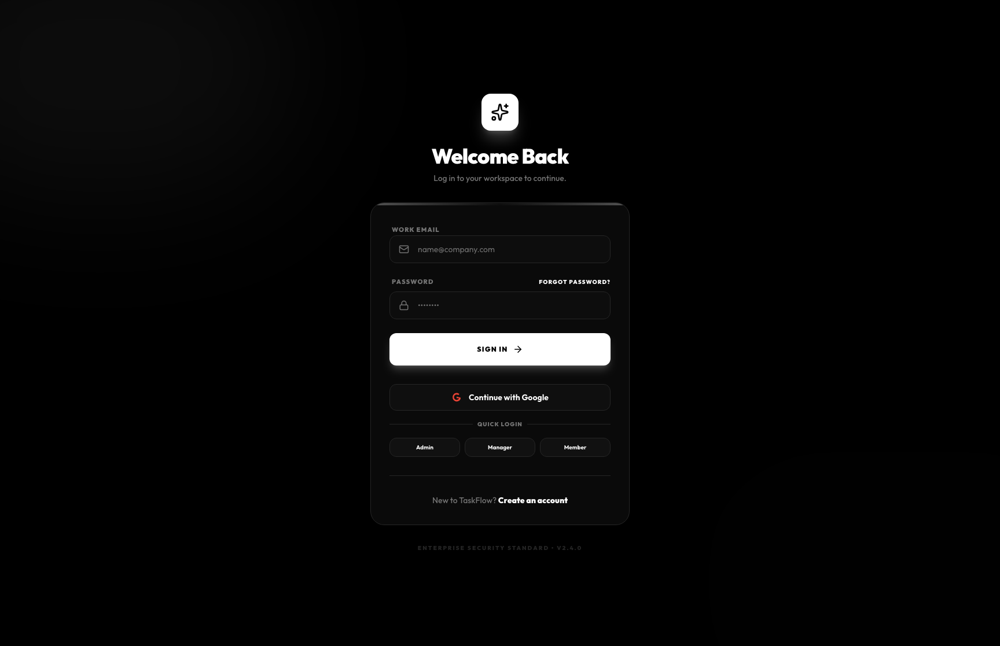
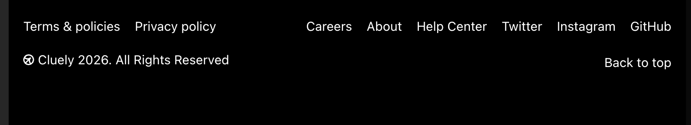
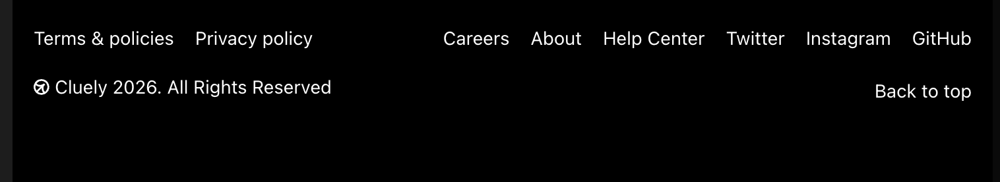
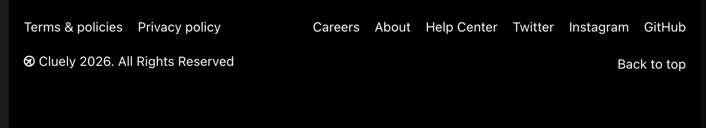

# 🧠 TaskFlow AI Assistant

> **AI-first project execution for modern teams**  
> Plan faster, prioritize smarter, and ship with confidence.

[](https://taskflowaiassistant.netlify.app/login)
[](#-tech-stack)
[](#-tech-stack)
[](#-tech-stack)

---

## 🚀 Live Demo
👉 https://taskflowaiassistant.netlify.app/login

---

## 🎥 Product Demo


### 🔐 Authentication Flow


### 🧠 AI Task Suggestions


### ✅ Task Management


### 🔔 Notifications


---

## 📸 Screenshots

### Login Page


### Dashboard


### Task Creation


### AI Suggestions


### Task List


---

## 🎯 Feature Demo (Step-by-Step)

### 🧠 AI Task Suggestions
**Demo Flow:**
1. User enters a task title or project context.
2. AI processes input through TaskFlow’s backend AI pipeline (`/ai/*` endpoints).
3. System returns refined tasks, priorities, and execution guidance.
4. User accepts or edits suggestions before saving.

**Output:**
- Improved task clarity
- Suggested priority and structure
- Faster planning cycles

---

### ✅ Task Management
**Demo Flow:**
1. User creates a task under a project.
2. Task is edited, commented on, or dependency-linked.
3. Task status moves across workflow (To Do → In Progress → Done).

**Output:**
- Organized execution pipeline
- Real-time state visibility
- Better ownership and delivery tracking

---

### 🔐 Authentication
**Demo Flow:**
1. User signs in with email/password or Google OAuth.
2. Backend issues JWT access + refresh tokens.
3. User session unlocks protected workspace routes.

---

### 🔔 Notifications
**Demo Flow:**
1. Activity events are generated (assignment, updates, deadlines).
2. Notification feed surfaces actionable updates.
3. User follows up directly from the workspace.

---

## ✨ Features

- 🧠 AI-assisted task generation, extraction, summaries, and chat support
- 📅 Multi-view planning: Dashboard, Kanban, Gantt, Calendar, Meetings
- 🔐 Authentication with JWT + Google OAuth + phone OTP hooks
- 🧩 Project analytics, activity logs, and team workspace views
- ⚡ Fast React UI with smooth transitions and responsive layouts
- 🗂 Task comments, dependencies, and file version support

---

## 🛠 Tech Stack

**Frontend**
- React 19 + TypeScript
- Vite + Tailwind CSS
- Framer Motion
- Axios + React Router
- Chart.js / react-chartjs-2

**Backend**
- Node.js + TypeScript
- Hono framework
- Prisma ORM
- JWT auth + bcrypt
- Nodemailer + integrations SDK

**AI Layer**
- OpenAI-compatible backend integration
- Anthropic + Gemini configuration support
- AI fallback mode for resilient responses

**Database**
- PostgreSQL (via Prisma)

**Deployment**
- Frontend: Netlify
- Backend: Railway/Render/Fly-compatible Node service

---

## ⚙️ Installation

```bash
git clone https://github.com/TEJSARISA/taskflow-ai-assistant.git
cd taskflow-ai-assistant
```

### 1) Backend Setup
```bash
cd backend
pnpm install
cp .env.example .env
# update environment values
pnpm db:generate
pnpm db:push
pnpm dev
```

Backend runs on `http://localhost:9000` by default.

### 2) Frontend Setup
```bash
cd ../frontend
pnpm install
cp .env.example .env
# set VITE_API_BASE_URL to your backend URL
pnpm dev
```

Frontend runs on `http://localhost:5173` by default.

---

## 🔐 Environment Variables

### Backend (`backend/.env`)
```env
PORT=9000
DATABASE_URL=postgresql://<user>:<password>@<host>:5432/<db>?schema=public
JWT_SECRET=your_jwt_secret
FRONTEND_DOMAIN=https://taskflowaiassistant.netlify.app
BACKEND_DOMAIN=https://your-backend-domain

# Google OAuth
GOOGLE_OAUTH_CLIENT_ID=your_google_client_id
GOOGLE_OAUTH_CLIENT_SECRET=your_google_client_secret
GOOGLE_OAUTH_REDIRECT_URI=https://taskflowaiassistant.netlify.app/login

# AI providers (choose one or more)
OPENAI_API_KEY=your_openai_key
ANTHROPIC_API_KEY=your_anthropic_key
GEMINI_API_KEY=your_gemini_key
AI_FALLBACK_MODE=true
```

### Frontend (`frontend/.env`)
```env
VITE_API_BASE_URL=https://your-backend-domain
VITE_AGENT_BASE_URL=http://localhost:3000
VITE_USE_MOCK_DATA=true
VITE_FORCE_LIVE_CHAT=false
VITE_GOOGLE_AUTH_MOCK_FALLBACK=true
```

---

## 📂 Folder Structure

```text
taskflow-ai-assistant/
├── backend/
│   ├── src/
│   │   ├── controllers/
│   │   ├── routes/
│   │   ├── services/
│   │   ├── middlewares/
│   │   └── prisma/
│   └── package.json
├── frontend/
│   ├── src/
│   │   ├── pages/
│   │   ├── components/
│   │   ├── services/
│   │   ├── context/
│   │   └── lib/
│   └── package.json
└── README.md
```

---

## 🧪 API Endpoints

### Auth
- `POST /auth/register`
- `POST /auth/login`
- `POST /auth/refresh`
- `GET /auth/google`
- `POST /auth/google/exchange`
- `GET /auth/me`

### Projects
- `GET /projects`
- `POST /projects`
- `GET /projects/:id`
- `PATCH /projects/:id`
- `DELETE /projects/:id`
- `GET /projects/:id/analytics`

### Tasks
- `GET /tasks`
- `POST /tasks`
- `GET /tasks/:id`
- `PATCH /tasks/:id`
- `DELETE /tasks/:id`
- `POST /tasks/:id/dependencies`
- `GET /tasks/:id/dependencies`

### AI
- `POST /ai/generate-tasks`
- `POST /ai/extract-tasks`
- `POST /ai/project-summary`
- `POST /ai/chat`
- `POST /ai/suggest-tasks`
- `POST /ai/generate-project-plan`

---

## 🧠 How AI Works

- User intent is captured from task, meeting, or chat workflows.
- Frontend sends structured payloads to secure backend AI endpoints.
- Backend normalizes requests and routes them to configured providers.
- System returns actionable outputs: refined tasks, summaries, priorities, and strategic next steps.
- If external AI is unavailable, fallback mode preserves UX continuity.

---

## 🚀 Deployment

### Frontend (Netlify)
- Production URL: https://taskflowaiassistant.netlify.app/login
- Build command: `pnpm build`
- Publish directory: `dist`
- SPA fallback: `_redirects` includes `/* /index.html 200`

### Backend (Railway / Render)
- Deploy `backend/` as a Node service
- Start command: `pnpm dev` (or compiled `node dist/index.js`)
- Required envs: DB URL, JWT secret, OAuth keys, frontend domain

---

## 📈 Future Improvements

- Multi-workspace team collaboration and role policies
- Native mobile clients with push notifications
- Deeper AI analytics and forecasting
- Voice-driven task capture and meeting ingestion
- Webhooks and third-party app marketplace integrations

---

## 🤝 Contributing

1. Fork the repository
2. Create a feature branch (`git checkout -b feature/your-feature`)
3. Commit changes (`git commit -m "feat: add your feature"`)
4. Push branch (`git push origin feature/your-feature`)
5. Open a Pull Request

Please include clear PR descriptions, screenshots/GIFs for UI changes, and test notes.

---

## 📄 License

MIT License.

---

### ⭐ If this project helps you, give it a star and share feedback.
